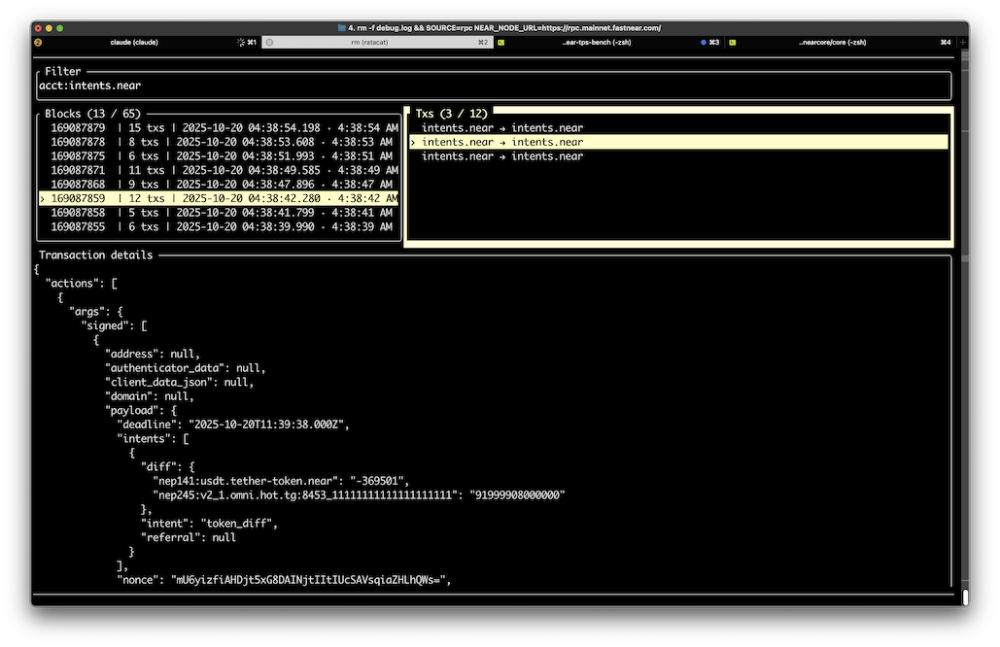
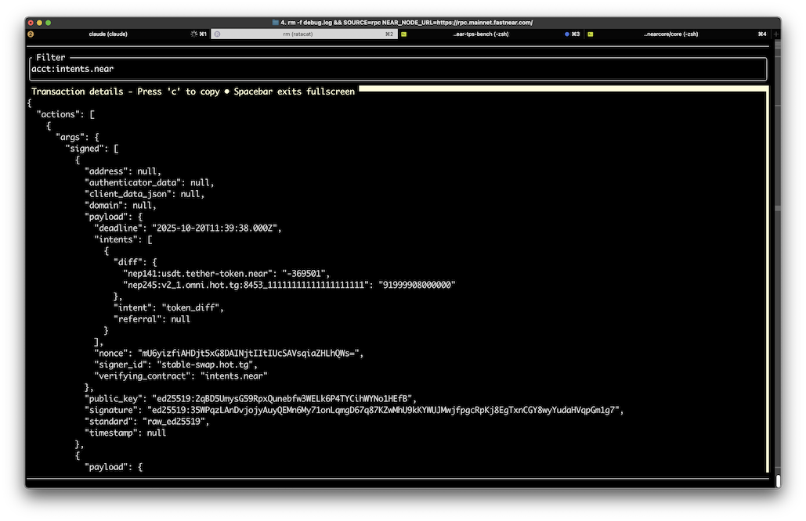

# NEARx — Quick Start (alpha)

### Run targets
```bash
# Terminal (TUI)
cargo run --bin nearx --features native

# Web (Trunk)
trunk serve --open

# Tauri (Desktop)
cd tauri-workspace && cargo tauri dev
```

### Build targets
```bash
# TUI release
cargo build --release --features native --bin nearx

# Web release
trunk build --release

# Tauri bundle
cd tauri-workspace && cargo tauri build
```

### Preflight (alpha)
```bash
./tools/preflight.sh
npm run e2e
```

---

# Ratacat - NEAR Blockchain Transaction Viewer

High-performance terminal UI for monitoring NEAR Protocol transactions in real-time. Runs as native terminal app, web browser app, or Tauri desktop app.

Built with [Ratatui](https://ratatui.rs) and Rust.

---

## Quick Start

**Clone and run:**

```bash
# 1. Clone the repo
git clone <repo-url>
cd ratacat

# 2. Run the desktop app (macOS/Linux/Windows)
cd tauri-workspace
cargo tauri dev
```

That's it! The app will open with live blockchain data from NEAR mainnet.

**For deep link testing (macOS only):**
```bash
./tauri-dev.sh test
```

---

## Screenshots

### 3-Pane Dashboard


Main interface: blocks on the left, transaction hashes in the middle, full transaction details on the right. Filter bar shows active filtering.

### Fullscreen Details


Press `Spacebar` to toggle fullscreen mode for maximum vertical space to inspect transaction payloads.

---

## Keyboard & Mouse

See **[docs/KEYMAP.md](docs/KEYMAP.md)** for complete shortcuts:
- **Tab/Shift+Tab**: Switch panes
- **Spacebar**: Toggle fullscreen details
- **c**: Copy focused content
- **Ctrl+F**: Search history
- **Mouse**: Click to select, scroll to navigate, double-click details for fullscreen

---

## Features

### Core
- **3-Pane Dashboard**: Blocks → Transaction Hashes → Transaction Details
- **Real-time Monitoring**: WebSocket (development) or RPC polling (production)
- **Smart Filtering**: Filter by account, action type, method name, or free text
- **Fullscreen Details**: Toggle with `Spacebar` for maximum inspection area
- **Archival Navigation**: Explore unlimited blockchain history (with `ARCHIVAL_RPC_URL`)

### Data & Search
- **Function Call Decoding**: Three-tier decoding (JSON → Text → Binary) with auto-parsing of nested JSON
- **SQLite History**: Non-blocking persistence for all transactions (native only)
- **Jump Marks**: Bookmark important blocks/transactions (`m` to set, `'` to jump)
- **History Search**: Full-text search with `Ctrl+F`
- **Owned Account Tracking**: Auto-detect your NEAR accounts from credentials, filter with `Ctrl+U`

### Performance
- **FPS Control**: Runtime adjustable (default 30 FPS, toggle with `Ctrl+O`)
- **Smart Caching**: ±12 blocks preserved around selection after aging out
- **Non-blocking I/O**: Async data fetching keeps UI responsive
- **Clipboard Integration**: Copy transaction details with `c`

### Multi-Platform
- **Native Terminal**: Full-featured TUI with SQLite, WebSocket support
- **Web Browser**: Same UI via WebAssembly (WASM), runs in any modern browser
- **Tauri Desktop**: Native desktop app with deep link support (`nearx://` URLs)

---

## Configuration

Configuration is loaded with priority: **CLI args > Environment variables > Defaults**

### Quick Configuration

```bash
# Watch specific accounts
WATCH_ACCOUNTS=alice.near,bob.near cargo tauri dev

# Use testnet
NEAR_NODE_URL=https://rpc.testnet.fastnear.com/ cargo tauri dev

# Disable filtering (show all transactions)
DEFAULT_FILTER= cargo tauri dev

# Add authentication (avoid rate limits)
FASTNEAR_AUTH_TOKEN=your_token cargo tauri dev
```

### Configuration File

Copy `.env.example` to `.env` and customize:

```bash
cp .env.example .env
vim .env
```

See `.env.example` for all available options (RPC endpoints, polling intervals, rendering settings, etc.).

---

## Building from Source

### Tauri Desktop (Recommended)

```bash
cd tauri-workspace

# Development
cargo tauri dev

# Production build
cargo tauri build
```

### Native Terminal

```bash
# Build release
cargo build --release --features native

# Run
./target/release/nearx

# With options
FASTNEAR_AUTH_TOKEN=your_token ./target/release/nearx
```

### Web Browser

```bash
# One-time setup
cargo install --locked trunk
rustup target add wasm32-unknown-unknown

# Development
trunk serve  # Opens at http://127.0.0.1:8083

# Production
trunk build --release  # Output in dist-egui/
```

---

## Testing

### Web E2E Smoke Tests (Playwright)

End-to-end tests verify the Web target works without WASM panics, keyboard/mouse input functions correctly, and clipboard copy operates.

**Prerequisites:**
- Node.js/npm installed
- Web target dependencies (`trunk`, `wasm32-unknown-unknown` target)

**Setup (one-time):**

```bash
# Install dependencies
npm install

# Install Playwright browsers
npm run e2e:install
```

**Run tests:**

```bash
# Run tests headless (default)
npm run e2e

# Run with visible browser (watch test execution)
npm run e2e:headed

# Interactive debug mode (step through tests)
npm run e2e:debug

# Strict mode: require valid JSON in clipboard (when RPC data is flowing)
NEARX_E2E_REQUIRE_DATA=1 npm run e2e
```

**What it tests:**
- ✅ No WASM runtime errors or panics
- ✅ Canvas renders and is visible
- ✅ Keyboard: Tab/Shift+Tab cycling works
- ✅ Mouse: Click into Blocks/Tx/Details regions
- ✅ Copy: Press 'c' key, verify clipboard readable
- ✅ Optional: Clipboard contains valid JSON (strict mode)

**Port usage:**
- E2E tests run on `http://127.0.0.1:5173` (via `trunk serve --release --port 5173`)
- Development server runs on `http://127.0.0.1:8083` (default from `Trunk.toml`)
- This separation allows running tests while development server is active

**Test configuration:**
- `playwright.config.ts` - Playwright settings
- `e2e/smoke.spec.ts` - Smoke test suite

---

## Development

### General Development (UI, features, logic)

```bash
cd tauri-workspace
cargo tauri dev
```
- Fast hot-reload
- Debug logging enabled
- DevTools: `Cmd+Option+I` (macOS) or `F12` (Windows/Linux)
- **Note:** Deep links won't work in dev mode (see below)

### For Deep Link Testing (macOS only)

macOS caches URL scheme registrations, so `cargo tauri dev` often runs old code when opened via deep links. Use the helper script instead:

```bash
# Build debug bundle and register for deep links
./tauri-dev.sh

# Or build, register, AND test with sample URL
./tauri-dev.sh test

# Clean up old registrations only
./tauri-dev.sh clean

# Show help
./tauri-dev.sh --help
```

**What the script does:**
1. Kills old app instances
2. Builds fresh debug .app bundle (includes symbols, faster than release)
3. Clears macOS Launch Services cache
4. Copies bundle to /Applications
5. Registers the app from /Applications for `nearx://` URLs
6. Optionally tests with `nearx://v1/tx/ABC123`

**Manual Deep Link Testing:**
```bash
# After running tauri-dev.sh, test with:
open 'nearx://v1/tx/ABC123'

# Monitor logs:
tail -f ~/Library/Logs/com.fastnear.nearx/NEARx.log
```

### Key Features
- Deep link handler for `nearx://v1/tx/HASH` URLs
- Single-instance enforcement (prevents duplicate launches)
- Native performance with desktop integration
- Comprehensive debug logging waterfall for deep link tracing

### Configuration

Set environment variables or copy `.env.example` to `.env`:

```bash
cp .env.example .env
```

Key settings:
- `NEAR_NODE_URL`: RPC endpoint (default: `https://rpc.mainnet.fastnear.com/`)
- `FASTNEAR_AUTH_TOKEN`: Authentication token to avoid rate limits
- `WATCH_ACCOUNTS`: Comma-separated account list (default: `intents.near`)
- `ARCHIVAL_RPC_URL`: Archival RPC for unlimited history navigation

---

## Architecture

**Quad-Mode Design**: Write once, run everywhere
- **Native Terminal**: Crossterm backend with SQLite persistence
- **Web Browser**: egui_ratatui bridge renders terminal UI in WebGL canvas
- **Tauri Desktop**: Same egui_ratatui bridge with native window chrome
- **Shared Core**: Same `ui.rs`, `app.rs`, `theme.rs` across all targets

**Key Technologies**:
- [Ratatui](https://ratatui.rs) - Terminal UI framework
- [egui_ratatui](https://github.com/gold-silver-copper/egui_ratatui) - Bridge for web/Tauri
- [Tauri v2](https://tauri.app) - Desktop app framework
- [Trunk](https://trunkrs.dev) - WASM build tool

---

## Project Structure

```
ratacat/
├── src/
│   ├── bin/
│   │   ├── nearx.rs          # Native terminal binary
│   │   ├── nearx-web.rs      # Web browser binary (WASM)
│   │   └── ratacat-proxy.rs  # RPC proxy (development)
│   ├── app.rs                # Application state (shared)
│   ├── ui.rs                 # Ratatui rendering (shared)
│   ├── theme.rs              # Unified theme system (shared)
│   └── ...                   # Other shared modules
├── tauri-workspace/
│   └── src-tauri/            # Tauri desktop app
├── web/
│   ├── platform.js           # Unified clipboard bridge
│   ├── auth.js               # OAuth popup manager
│   └── router_shim.js        # Hash router for auth callbacks
├── tauri-dev.sh              # Deep link testing helper (macOS)
├── index-egui.html           # Web app entry point
├── Trunk.toml                # Web build configuration
└── .env.example              # Configuration template
```

---

## Contributing

See **[COLLABORATION.md](COLLABORATION.md)** for detailed development guidelines.

Key points:
- All UI changes should work across all targets (native, web, Tauri)
- Test with `cargo check --all-targets --all-features`
- Run formatters: `cargo fmt` and `cargo clippy`
- For deep link changes, test with `./tauri-dev.sh test`

---

## Documentation

- **[CLAUDE.md](CLAUDE.md)** - Comprehensive technical documentation
- **[COLLABORATION.md](COLLABORATION.md)** - Development guidelines
- **[docs/KEYMAP.md](docs/KEYMAP.md)** - Keyboard and mouse shortcuts
- **[.env.example](.env.example)** - Configuration options

---

## License

[Your License Here]

---

Built with ❤️ using Ratatui, Tokio, and Rust. Designed for NEAR Protocol monitoring.
